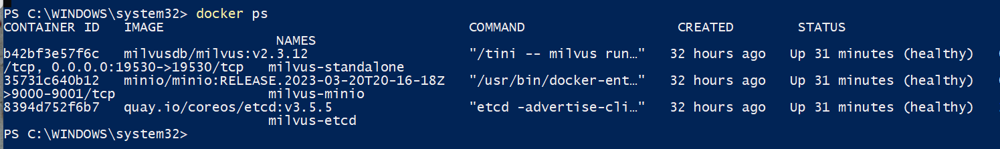

# RuoYi AI


<h3 style="text-align: center;">快速搭建属于自己的 AI 助手平台</h3>

<p style="text-align: center;">
    全新升级，开箱即用，简单高效
    <br />
    <br />
    ·
    <a href="https://github.com/ryu-shen/ruoyi-ai/issues">报告Bug</a>
    ·
    <a href="https://github.com/ryu-shen/ruoyi-ai/issues">提出新特性</a>
</p>

## 目录

- [源码地址](#源码地址)
- [特色功能](#特色功能)
- [开发前的配置要求](#开发前的配置要求)
- [前端启动](#前端启动)
- [开发依赖](#开发依赖)
- [文件目录说明](#文件目录说明)
- [使用到的框架](#使用到的框架)
- [项目演示](#项目演示)
  - [后台管理](#后台管理)
- [贡献者](#贡献者)
  - [如何参与开源项目](#如何参与开源项目)
- [版本控制](#版本控制)
- [版权说明](#版权说明)
- [鸣谢](#鸣谢)


### 源码地址
- https://github.com/ryu-shen/ruoyi-ai

### 特色功能
1. 多模态：支持DeepSeek / Gitee AI / 阿里通义 / 百度千帆 / 抖音豆包 / 智谱清言 / 零一万物 / 讯飞星火 / OpenAI / Gemini / Ollama / Azure / Claude 等大模型
2. 动态配置：支持再页面上可视化动态配置大模型参数、Key等信息
3. 知识库：支持向量化知识库文档，定制化Prompt对话场景
4. 高级RAG：支持Embedding模型，从知识库中精确搜索
5. 支持动态配置Embedding模型和向量数据库
6. 支持不同的知识库关联不同的模型和向量数据库

### 开发依赖

1. jdk 17+
2. mysql 5.7、8.0
3. redis 版本必须 >= 5.X
4. maven 3.8+
5. Milvus/PGVector
6. Minio等OSS存储
7. nodejs 22+ & pnpm

### 前端启动

- pnpm config set registry https://registry.npmmirror.com
- pnpm config set registry https://registry.npmjs.org/
- cd langchain-ui
- pnpm install
- pnpm run dev

### 开发前的配置要求
1. Jdk 17+
2. Mysql 5.7、8.0
3. Redis 版本必须 >= 5.X
4. Maven 3.8+
5. Milvus/PGVector
6. Minio等OSS存储
7. Nodejs 22+ & pnpm

### 文件目录说明
RuoYi-AI

```
├─ ruoyi-admin                         // 管理模块
│  └─ RuoYiApplication                 // 启动类
│  └─ RuoYiServletInitializer          // 容器部署初始化类
│  └─ resources                        // 资源文件
│      └─ i18n/messages.properties     // 国际化配置文件
│      └─ application.yml              // 框架总配置文件
│      └─ application-dev.yml          // 开发环境配置文件
│      └─ application-prod.yml         // 生产环境配置文件
│      └─ banner.txt                   // 框架启动图标
│      └─ logback-plus.xml             // 日志配置文件
│      └─ ip2region.xdb                // IP区域地址库
├─ ruoyi-common                        // 通用模块
│  └─ ruoyi-common-bom                 // common依赖包管理
   └─ ruoyi-common-agi                 // AI公共模块
│  └─ ruoyi-common-core                // 核心模块
│  └─ ruoyi-common-doc                 // 系统接口模块
│  └─ ruoyi-common-encrypt             // 数据加解密模块
│  └─ ruoyi-common-excel               // excel模块
│  └─ ruoyi-common-idempotent          // 幂等功能模块
│  └─ ruoyi-common-json                // 序列化模块
│  └─ ruoyi-common-log                 // 日志模块
│  └─ ruoyi-common-mail                // 邮件模块
│  └─ ruoyi-common-mybatis             // 数据库模块
│  └─ ruoyi-common-oss                 // oss服务模块
│  └─ ruoyi-common-ratelimiter         // 限流功能模块
│  └─ ruoyi-common-redis               // 缓存服务模块
│  └─ ruoyi-common-satoken             // satoken模块
│  └─ ruoyi-common-security            // 安全模块
│  └─ ruoyi-common-sensitive           // 脱敏模块
│  └─ ruoyi-common-sms                 // 短信模块
│  └─ ruoyi-common-social              // 授权认证模块
│  └─ ruoyi-common-sse                 // sse模块
│  └─ ruoyi-common-tenant              // 租户模块
│  └─ ruoyi-common-translation         // 通用翻译模块
│  └─ ruoyi-common-web                 // web模块
│  └─ ruoyi-common-websocket           // websocket模块
├─ ruoyi-modules                       // 模块组
│  └─ ruoyi-demo                       // 演示模块
│  └─ ruoyi-generator                  // 代码生成模块
│  └─ ruoyi-langchain                  // AI模块
│  └─ ruoyi-system                     // 系统模块
│  └─ ruoyi-system-config              // 参数配置模块
│  └─ ruoyi-system-oss                 // oss模块
├─ .run                 // 执行脚本文件
├─ .editorconfig        // 编辑器编码格式配置
├─ LICENSE              // 开源协议
├─ pom.xml              // 公共依赖
├─ README.md            // 框架说明文件
```

### 使用到的框架
- [Naive UI](https://www.naiveui.com)
- [RuoYi-Vue-Plus](https://gitee.com/dromara/RuoYi-Vue-Plus)

### 项目演示
#### 后台管理
<div style="display: flex; flex-wrap: wrap; gap: 20px; justify-content: center;">
  
  
  
  
  
  
  
  
  
  
  
  
  
  
  
</div>

### 贡献者
请阅读[CONTRIBUTING](https://github.com/ryu-shen/ruoyi-ai/graphs/contributors) 查阅为该项目做出贡献的开发者。
#### 如何参与开源项目
贡献使开源社区成为一个学习、激励和创造的绝佳场所。你所作的任何贡献都是**非常感谢**的。

1. Fork the Project
2. Create your Feature Branch (`git checkout -b feature/AmazingFeature`)
3. Commit your Changes (`git commit -m 'Add some AmazingFeature'`)
4. Push to the Branch (`git push origin feature/AmazingFeature`)
5. Open a Pull Request

### 版本控制
该项目使用Git进行版本管理。您可以在repository参看当前可用版本。
### 版权说明
该项目签署了MIT 授权许可，详情请参阅 [LICENSE.txt](https://github.com/ryu-shen/ruoyi-ai/blob/main/LICENSE)
### 鸣谢
- [langchain4j](https://github.com/langchain4j/langchain4j)
- [RuoYi-Vue-Plus](https://gitee.com/dromara/RuoYi-Vue-Plus)